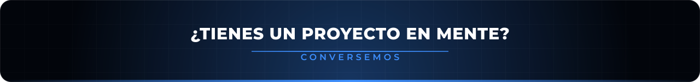

<!-- ===================== HEADER ===================== -->

  

  

  
  
  

---

## 👨‍💻 Sobre mí

- 🔭 Desarrollo sistemas web y móviles para la gestión universitaria y del sector público.
- ⚡ Trabajando con **.NET 10**, **Angular** e integración de **IA** en aplicaciones de negocio.
- 🛠️ Despliego y administro mis propios servidores Linux (Nginx, PostgreSQL, Cloudflare).
- 💬 Pregúntame sobre **.NET, Angular, Flutter, SQL Server** y sistemas de **tracking GPS**.

---

## 🧰 Tech Stack

<table align="center">
  <tr>
    <td align="center" width="140"><b>Backend</b></td>
    <td></td>
  </tr>
  <tr>
    <td align="center"><b>Frontend</b></td>
    <td></td>
  </tr>
  <tr>
    <td align="center"><b>Mobile</b></td>
    <td></td>
  </tr>
  <tr>
    <td align="center"><b>Bases de datos</b></td>
    <td>&nbsp;</td>
  </tr>
  <tr>
    <td align="center"><b>Infra & Tools</b></td>
    <td></td>
  </tr>
</table>

---

## 🚀 Sistemas que he desarrollado

| Sistema | Descripción | Stack |
|:--|:--|:--|
| **SIGRAT** | Gestión de grados y títulos 100% digital (cero papel) | .NET 8 · Angular · SQL Server |
| **SAI** | Sistema de Archivo Institucional | .NET 8 · Angular · SQL Server |
| **Buses UNTRM** | Rastreo GPS en tiempo real de buses universitarios | Flutter · .NET 8 · Angular |
| **Fleet Tracker** | Rastreo de flota vehicular usando el GPS del teléfono | Flutter · .NET 8 · Angular |
| **SGB** | Gestión bibliotecaria, migrada de PHP/jQuery a arquitectura moderna | .NET 8 · Angular |
| **Control de Combustible** | Gestión de combustible para establecimientos de salud | .NET 8 · Angular 20 |

---

## 🐍 Contribuciones

  <picture>
    <source media="(prefers-color-scheme: dark)" srcset="https://raw.githubusercontent.com/Identto/Identto/output/github-snake-dark.svg" />
    <source media="(prefers-color-scheme: light)" srcset="https://raw.githubusercontent.com/Identto/Identto/output/github-snake.svg" />
    
  </picture>

 

<!-- ===================== FOOTER ===================== -->

  

